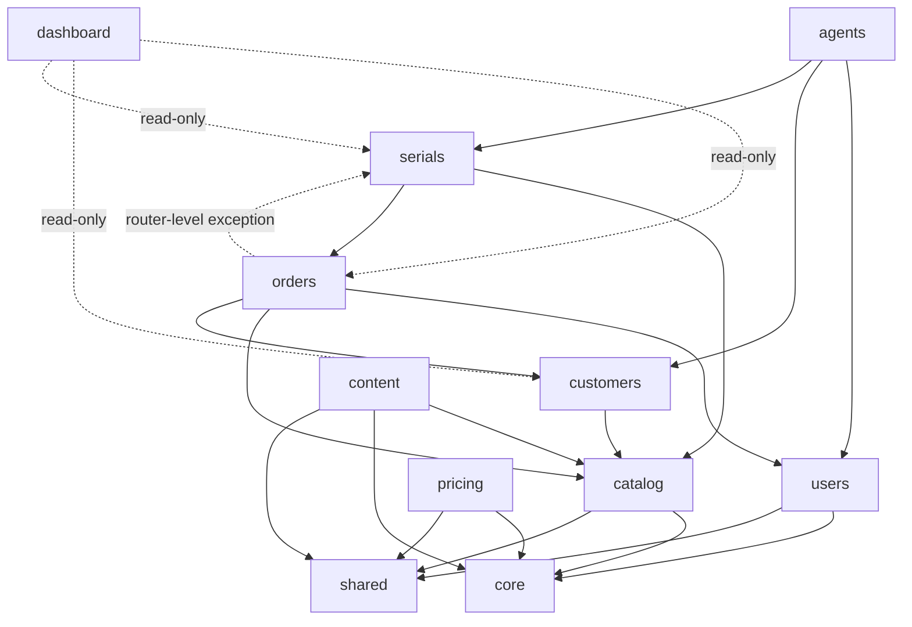

# 02 — Domain Map

| Domain | Models (tables) | Routers (paths unchanged) | Services / notes |
|---|---|---|---|
| `users` | User, AuditLog | auth, admin_users, admin_audit | owns auth Depends (`require_admin/agent/superadmin`) |
| `catalog` | Product, ImportJob | admin_catalog (products), public `/products*`, `/admin/media` | product_import, minio_import |
| `content` | Landing, Portfolio, FAQ | admin_landings, admin_portfolios, FAQ endpoints, public `/landings/*`, `/portfolios*`, `/faqs` | content_defaults moves in from core |
| `pricing` | GoldPriceSnapshot | admin_prices, public `/prices` | gold_prices incl. background refresh loop |
| `customers` | Customer, CustomerAddress, Favorite, OtpCode | account, admin_customers | `require_customer` dep |
| `orders` | Order, OrderItem, OrderStatusLog | admin_orders, public `/orders*` | services/orders |
| `serials` | ProductSerial, SerialEvent, SerialScan, Warranty, BuybackRequest | admin_serials, admin_buybacks, public `/serials/*` (verify, qr, warranty, buyback) | service.py — sole mutation surface for ProductSerial. **Warranty merged in during migration**: the passport endpoint (verify) reads serial+warranty+buyback together and warranty routes need the serials service — a two-way dependency, which per the merge rule means one domain. |
| `agents` | AgentRetailer, AgentVisit, MobileGalleryItem | agent, admin_gallery | mutates serials only via serials service |
| `dashboard` | — | admin_stats | read-only cross-domain aggregation |

Cross-cutting: `core/` (config, db, security, logging, cache, metrics, limiter, storage, client_logs) and `shared/` (notifications, constants).

## Dependency DAG

**Known exception (documented, contract-ignored):** `orders.router_admin` calls
`serials.service` (delivery auto-mints serials; manual generate-serials endpoint;
csv_safe). The reverse edge `serials → orders` is model/service-level. Both go
through public surfaces; the import-linter DAG contract carries an explicit
`ignore_imports` for `app.domains.orders.router_admin -> app.domains.serials`.

**Shared-mutable-model rule:** `ProductSerial` is touched by serials/orders/agents →
`serials` owns the model; others go through the serials service's public functions
(already true today). No model moves to `shared/`.
