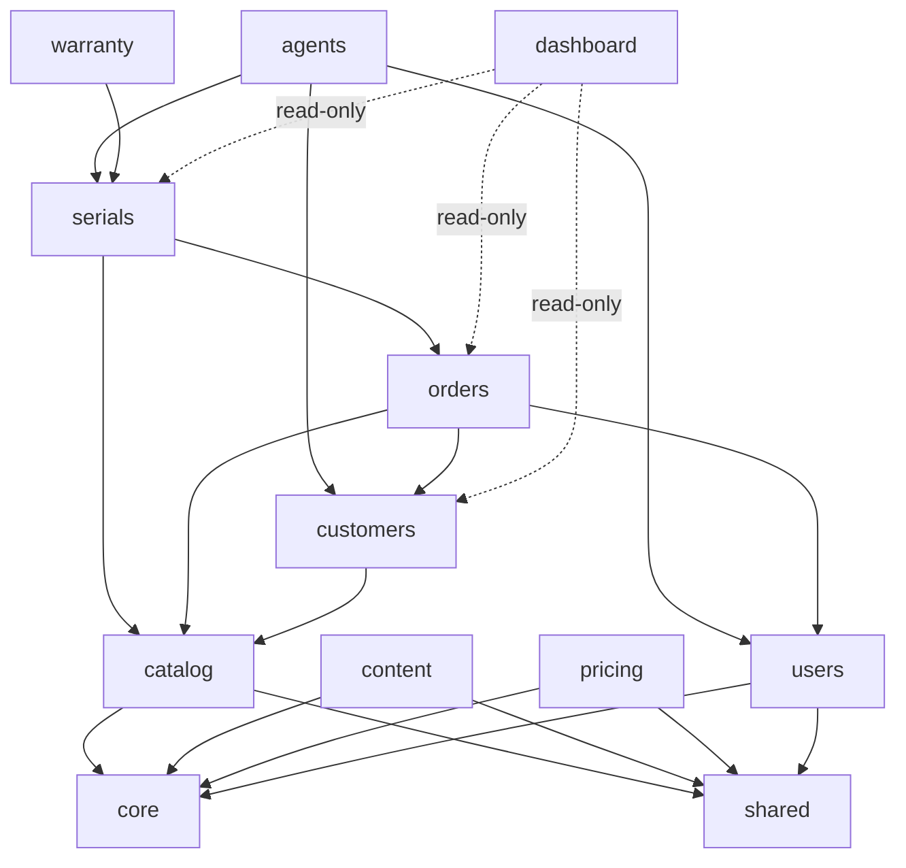

# 02 — Domain Map

| Domain | Models (tables) | Routers (paths unchanged) | Services / notes |
|---|---|---|---|
| `users` | User, AuditLog | auth, admin_users, admin_audit | owns auth Depends (`require_admin/agent/superadmin`) |
| `catalog` | Product, ImportJob | admin_catalog (products), public `/products*`, `/admin/media` | product_import, minio_import |
| `content` | Landing, Portfolio, FAQ | admin_landings, admin_portfolios, FAQ endpoints, public `/landings/*`, `/portfolios*`, `/faqs` | content_defaults moves in from core |
| `pricing` | GoldPriceSnapshot | admin_prices, public `/prices` | gold_prices incl. background refresh loop |
| `customers` | Customer, CustomerAddress, Favorite, OtpCode | account, admin_customers | `require_customer` dep |
| `orders` | Order, OrderItem, OrderStatusLog | admin_orders, public `/orders*` | services/orders |
| `serials` | ProductSerial, SerialEvent, SerialScan | admin_serials, public `/serials/verify`, `/serials/{code}/qr.png` | services/serials — sole mutation surface for ProductSerial |
| `warranty` | Warranty, BuybackRequest | admin_buybacks, public `/serials/{code}/warranty\|buyback` | |
| `agents` | AgentRetailer, AgentVisit, MobileGalleryItem | agent, admin_gallery | mutates serials only via serials service |
| `dashboard` | — | admin_stats | read-only cross-domain aggregation |

Cross-cutting: `core/` (config, db, security, logging, cache, metrics, limiter, storage, client_logs) and `shared/` (notifications, constants).

## Dependency DAG

No cycles. **Shared-mutable-model rule:** `ProductSerial` is touched by serials/orders/agents → `serials` owns the model; others go through `services/serials.py` public functions (already true today). No model moves to `shared/`.
